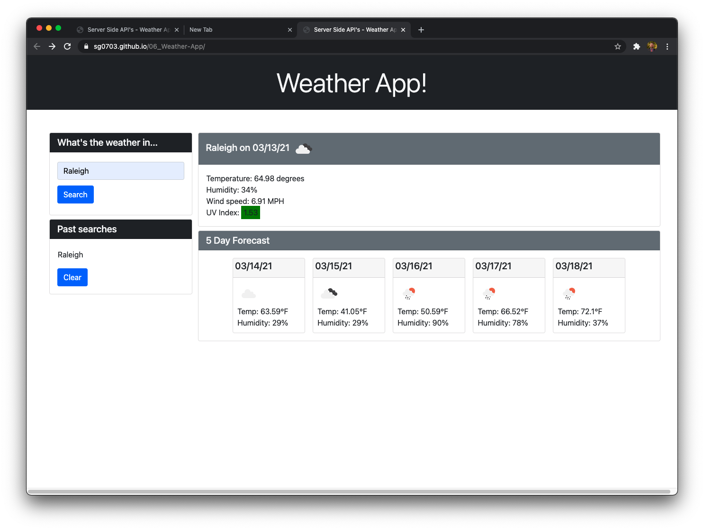
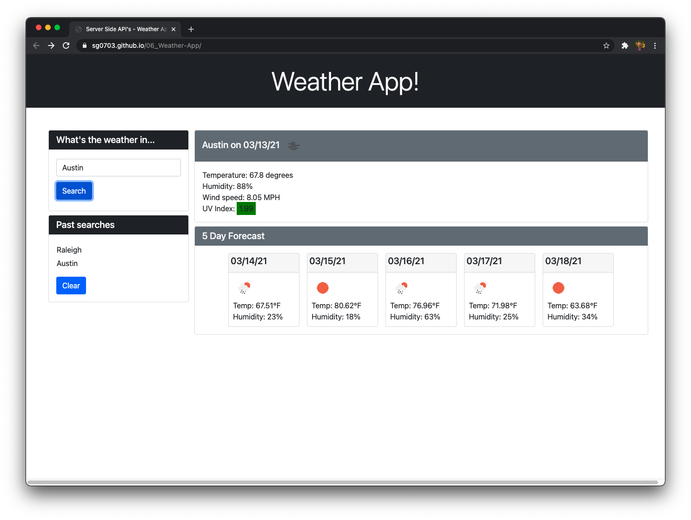
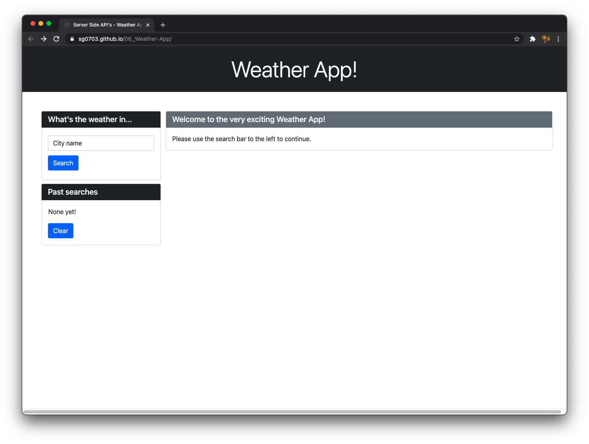

## 06 - Server Side API's: Weather App 

## Description

For this homework assignment, I created a weather app that utilizes the OpenWeather API to search for a specific city and return weather data, including a 5 day forecast, for that city. 

The user is greeted with a starting web page that asks them to enter a city in a search box. Below the search box is a list of past searches. If no past searches exist, then the user will see a default message in that space. 

Once the user searches for a city, if the search is successful, it is immediately added to the list of past searches. The user will see a page with the current conditions, including a small icon representing those conditions, in the main content section under a header with the city name and the date. The user will see temperature, humidity, wind speed, and the UV index with a color code indicating how safe the UV level is for that day. 

Below the main content section with the current conditions, the user will see a 5 day forecast complete with dates, a small icon representing predicted conditions on that day, the temperature and the humidity for that day. 

If the user wants to clear the list of past searches, there is a clear button for that purpose. Once clicked, it will immediately remove items from the list and take the user back to the start page. 

I utilized jQuery, Bootstrap, moment.js, and the OpenWeather API for this project. 

## Actions taken

1. Utilized HTML and Bootstrap to create a page with placeholders to insert data and a form to gather user input. 
2. Researched and implemented the OpenWeather Geocoding API to get latitude/longitude coordinates for user queries
3. Researched and implemented the OpenWeather One Call API to get current and forecast weather data 
4. Implemented error handling to display a page if the API cannot locate data for the user input
5. Utilized jQuery to gather user input and to dynamically generate the page
6. Utilized moment.js to handle date formatting from API data
7. Wrote displayStart() to generate a starter page
8. Wrote showResults() to search both API's and call supporting functions to display page from API data
9. displayToday() and displayForecast() create content for the current conditions and the forecast, display to page
10. Created addPastSearch(), displaySearches(), and clearPastSearches() to store, retrieve, display and erase past searches from local storage
11. Created getDate to quickly format dates using moment.js
12. Created alreadySaved() to check local storage object for search so that it isn't entered twice

## Link to deployed project

See the deployed project by following this link: https://sg0703.github.io/06_Weather-App/
See the code repository here: https://github.com/sg0703/06_Weather-App

## Screenshots

